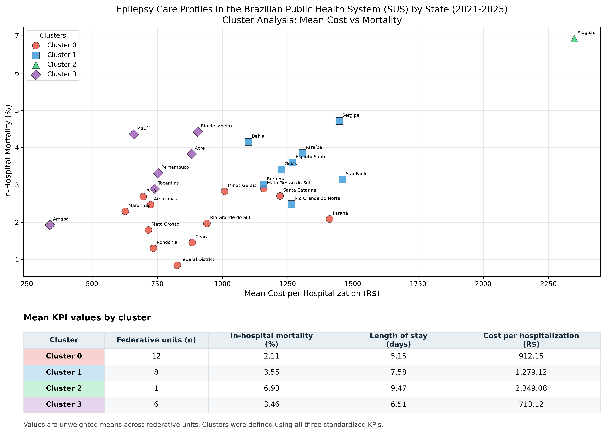

# Perfis de assistência à epilepsia no SUS (2021–2025)

Material de apoio à avaliação do trabalho **Unveiling care patterns: Unsupervised machine learning clustering of epilepsy hospitalizations in the Brazilian public health system (2021–2025)**, para o Congresso Brasileiro de Neurologia 2026.

Este pacote reúne o código, os dados agregados utilizados na análise, as tabelas de resultados, as figuras e a versão disponível do resumo. Autor identificado no PDF: Henrique Benatti Rodrigues Pereira.

## Guia para avaliadores

| Material | Arquivo |
|---|---|
| Análise principal | [analise_cluster.py](analise_cluster.py) |
| Dados de entrada por unidade federativa | [epilepsia_estados.csv](epilepsia_estados.csv) |
| Indicadores e classificação das 27 UFs | [dados_clusters_completo.csv](dados_clusters_completo.csv) |
| Médias dos indicadores por grupo | [perfil_clusters.csv](perfil_clusters.csv) |
| Gráfico com tabela de indicadores | [clusters_epilepsia_with_table_en.png](clusters_epilepsia_with_table_en.png) |
| Visualização dos três indicadores | [clusters_epilepsia_3d_en.png](clusters_epilepsia_3d_en.png) · [SVG](clusters_epilepsia_3d_en.svg) |
| Mapa dos grupos | [mapa_clusters_brasil_en.png](mapa_clusters_brasil_en.png) · [SVG](mapa_clusters_brasil_en.svg) |
| Método do cotovelo | [elbow_method_en.png](elbow_method_en.png) |
| Resultados em texto | [results_abstract.txt](results_abstract.txt) |
| Resumo e referências (versão disponível; campo de instituição ainda provisório) | [PDF do trabalho](Unveiling%20care%20patterns_%20Unsupervised%20machine%20learning%20clustering%20of%20epilepsy%20hospitalizations%20in%20the%20brazilian%20public%20health%20system%20%282021-2025%29.pdf) |
| Origem e definição das variáveis | [DADOS.md](DADOS.md) |
| Verificação de reprodução | [VALIDACAO.md](VALIDACAO.md) |



## Método implementado

A unidade de análise é a unidade federativa: 26 estados e o Distrito Federal. O período e a seleção CID-10 G40–G41 constam do resumo. O código recebe uma tabela já agregada, não consulta o SIH/SUS e não verifica os filtros da extração original.

São calculados mortalidade hospitalar (%), valor médio por internação (R$) e permanência média (dias). As três variáveis são padronizadas com `StandardScaler`. O código calcula a inércia para K de 2 a 6 e aplica K-Means com **K=4 fixado**, `random_state=42` e `n_init=10`. A seleção de K não é automatizada.

As médias dos grupos são médias aritméticas dos indicadores das UFs, sem ponderação pelo número de internações. Os indicadores nacionais usam os totais de internações, óbitos, valores e dias de permanência.

| Grupo | UFs | Mortalidade (%) | Valor médio (R$) | Permanência (dias) |
|---|---:|---:|---:|---:|
| 0 | 12 | 2,11 | 912,15 | 5,15 |
| 1 | 8 | 3,55 | 1.279,12 | 7,58 |
| 2 | 1 | 6,93 | 2.349,08 | 9,47 |
| 3 | 6 | 3,46 | 713,12 | 6,51 |

Total: **320.419 internações**, **9.301 óbitos**. Silhouette: **0,315950**, arredondado para **0,316**.

## Reprodução

Baixe o repositório, descompacte-o e abra um terminal nessa pasta. Crie um ambiente Python e instale as dependências:

```sh
python -m venv .venv
```

Ative-o no Windows PowerShell com `.venv\Scripts\Activate.ps1`, ou no macOS/Linux com `source .venv/bin/activate`. Depois:

```sh
python -m pip install -r requirements.txt -r requirements_mapa.txt
python analise_cluster.py
python gerar_graficos_ingles.py
python gerar_grafico_3d.py
python gerar_mapa_clusters.py
```

Execute a análise principal a partir da pasta do repositório. Ela sobrescreve as tabelas, os gráficos em português e o texto de resultados. Os scripts de visualização utilizam as classificações salvas em `dados_clusters_completo.csv`. A malha do IBGE acompanha o pacote; o mapa só tenta baixá-la se esse arquivo estiver ausente.

Para verificar apenas a correspondência entre a tabela e a malha:

```sh
python gerar_mapa_clusters.py --validate-only
```

As versões observadas na verificação estão em [VALIDACAO.md](VALIDACAO.md). Os arquivos de requisitos originais usam versões mínimas, portanto instalações futuras podem produzir diferenças numéricas ou gráficas.

## Interpretação e limites

O agrupamento descreve padrões agregados; não inclui ajuste por idade, gravidade ou composição dos casos. Os nomes interpretativos presentes no resumo e no texto gerado não resultam de uma avaliação causal de eficiência ou qualidade assistencial. O código não realiza testes de significância estatística entre os grupos. O intervalo de mortalidade citado ao final do texto gerado corresponde às **médias dos grupos**, não aos valores mínimo e máximo entre UFs.

O CSV contém dados agregados, sem registros individuais de pacientes. Ainda falta o registro completo dos filtros e da data de extração para permitir repetir a consulta à fonte, conforme [DADOS.md](DADOS.md).

## Conteúdo e atribuição

Os arquivos científicos originais foram preservados neste pacote. Pastas de dependências, caches, configurações locais e arquivos auxiliares de assistentes não fazem parte da distribuição.

A fonte cartográfica é o IBGE, identificada no script do mapa. A fonte dos dados hospitalares é declarada no resumo como SIH/SUS. Nenhuma licença de redistribuição ou de reutilização foi acrescentada em nome do autor; a escolha de licença para código e demais materiais ainda precisa ser definida pelo titular.
